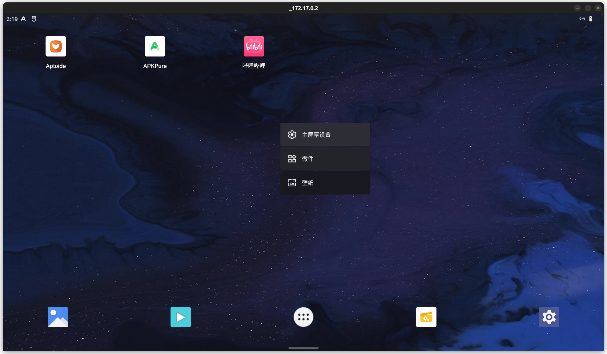
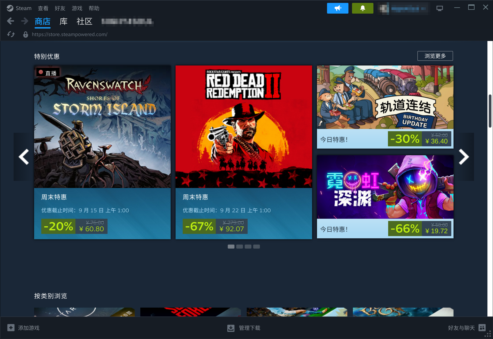
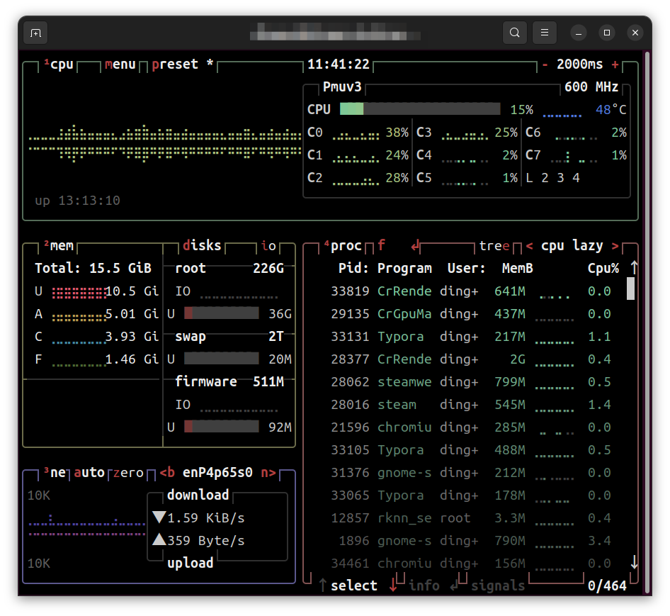

# NanoPC-T6-RK3588 Ubuntu使用记录

## Ubuntu

使用 https://github.com/Joshua-Riek/ubuntu-rockchip 提供的系统

具体刷机方法参考: https://github.com/Joshua-Riek/ubuntu-rockchip/wiki/NanoPC-T6

## 使用容器运行Android (Android In Container )

#### 安装docker

> ```shell
> sudo apt install apt-transport-https ca-certificates curl software-properties-common gnupg lsb-release
> curl -fsSL https://download.docker.com/linux/ubuntu/gpg | sudo gpg --dearmor -o /usr/share/keyrings/docker-archive-keyring.gpg
> echo "deb [arch=$(dpkg --print-architecture) signed-by=/usr/share/keyrings/docker-archive-keyring.gpg] https://download.docker.com/linux/ubuntu $(lsb_release -cs) stable" | sudo tee /etc/apt/sources.list.d/docker.list > /dev/null
> sudo apt update
> sudo apt install docker-ce docker-ce-cli containerd.io docker-compose-plugin
> ```

​	验证是否成功安装

> ```shell 
> sudo docker info
>  ```

#### 不使用sudo运行docker

> ```shell
> sudo groupadd docker
> sudo gpasswd -a ${USER} docker
> sudo systemctl restart docker
> sudo chmod a+rw /var/run/docker.sock
> ```

​	验证是否成功:

> ``` shell
> docker images
> ```

#### 安装运行android镜像

> ```shell
> docker run -itd --rm --privileged --pull always -v ~/data:/data -p 5555:5555 chisbread/rk3588-gaming:redroid-firefly androidboot.redroid_height=1600 androidboot.redroid_width=2560 androidboot.redroid_dpi=480 androidboot.redroid_gpu_mode=host --mount=type=bind，source=/dev/mali0，destination=/dev/mali0
> ```

​	修改以下参数来修改分辨率

> ```shell
> androidboot.redroid_height=1080
> androidboot.redroid_width=1920
> ```

#### 安装adb

> ```shell
> sudo apt update
> sudo apt install adb
> ```

#### 安装scrcpy

> ```shell
> sudo apt update
> sudo apt install scrcpy
> ```

#### 连接android

> ```shell
> adb connect localhost:5555
> ```

​	断开使用

> ```shell
> adb disconnect localhost:5555
> ```

#### 使用Scrcpy查看android 屏幕

> ```shell
> scrcpy -s localhost:5555
> ```



## box86

> ```shell
> sudo wget https://ryanfortner.github.io/box86-debs/box86.list -O /etc/apt/sources.list.d/box86.list
> wget -qO- https://ryanfortner.github.io/box86-debs/KEY.gpg | sudo gpg --dearmor -o /etc/apt/trusted.gpg.d/box86-debs-archive-keyring.gpg 
> sudo apt update && sudo apt install box86-rk3588 -y
> ```

## box64

> ```shell
> sudo wget https://ryanfortner.github.io/box64-debs/box64.list -O /etc/apt/sources.list.d/box64.list
> wget -qO- https://ryanfortner.github.io/box64-debs/KEY.gpg | sudo gpg --dearmor -o /etc/apt/trusted.gpg.d/box64-debs-archive-keyring.gpg 
> sudo apt update && sudo apt install box64-rk3588 -y
> ```

## steam

steam需要先安装box86和box64

- 设置环境变量

  > ``` shell
  > echo 'export STEAMOS=1
  > export STEAM_RUNTIME=1
  > export DOTNET_SYSTEM_GLOBALIZATION_INVARIANT=1' | sudo tee /etc/profile.d/steam.sh
  > 
  > #if you have a high resolution screen use this instead
  > #echo 'export GDK_SCALE=2' | sudo tee -a /etc/profile.d/steam.sh
  > source /etc/profile.d/steam.sh
  > ```

- 安装

> ```shell
> git clone https://github.com/ptitSeb/box86.git
> cd ~/box86
> ./install_steam.sh
> ```

- 运行

  > ```shell
  > steam
  > ```



## btop

> ```shell
> #安装
> sudo snap install btop
> 
> #启动
> btop
> ```


